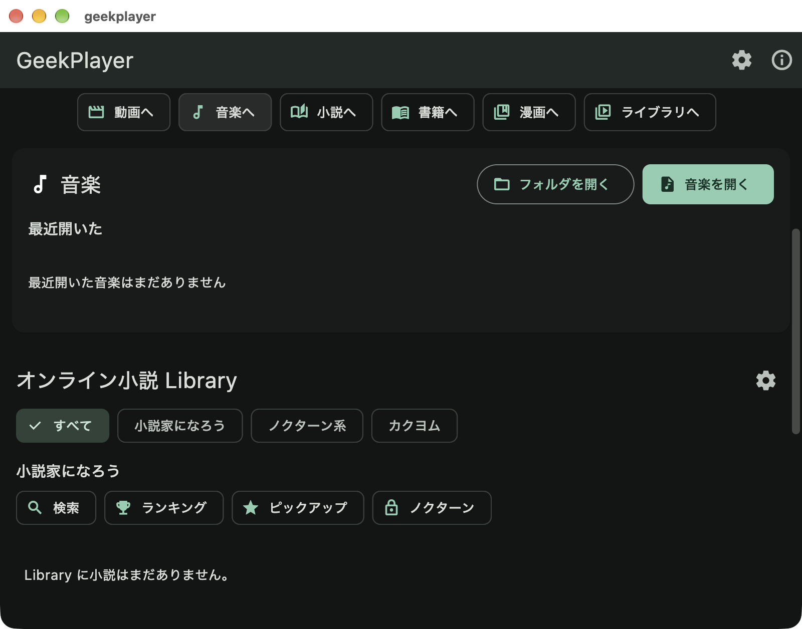

# #51 検証記録

確認日: 2026-10-09

## 実装と自動検証

`feature/improve-home-discoverability` で、6つのジャンプ先、日英ラベル、tooltip、48dpの操作領域、Tab/Enter操作を追加した。既存のセクション実装・順序・データ層は変更していない。

`ListView(children: ...)` の遅延構築により、初期表示から離れたセクションへのジャンプが失敗することを先に再現した。縦ListViewの中にColumnを1つ置いてアンカーを構築し、同じテストが成功することを確認した。

| 確認 | 結果 |
|---|---|
| 新規7テストと既存ホーム画面テスト | 8件成功 |
| 全 `flutter test --no-pub` | 639件成功 |
| `flutter analyze --no-pub --fatal-infos` | 指摘なし |
| `dart format --output=none --set-exit-if-changed .` | 381ファイル、変更なし |
| `openspec validate --all --strict` | 49件成功 |
| `git diff --check` | 成功 |
| 独立した仕様レビュー | ブロッキング指摘なし |
| `graphify update .` | AST更新成功。生成物はgitignore対象 |

新規テストは、遠いセクションへの往復、360×640の画面でのTab/Enterによる全ジャンプ先への移動、日英ラベル、tooltip/semantics、最小操作領域、登録順・登録済みの対象のみの表示を確認する。追加の3ケースで、前方セクションの遅延読み込み後も見出しを可視に保つこと、ユーザーのドラッグ・PageDown後は追従をやめることを確認する。実際のレジストリを使う既存テストにも6チップの確認を追加した。

ログは `/tmp/geekplayer-{format,analyze,tests,openspec,quick-jump-red,quick-jump-lazy,quick-jump-green,graphify}.log` に保存した。これらはローカル一時ファイルである。

## 変更後アプリの実機確認

- 対象: `49d94b0813627aa2e1911a1f2bec6d649d165936`、[PR #71](https://github.com/geekjapan/GeekPlayer/pull/71)。アプリ内のコンパイル済みバージョン文字列でも同じSHAを確認した。
- 環境: macOS 27.0.1 / arm64、800×628論理ピクセルのウィンドウ。ローカルのFlutterは3.44.0 / Dart 3.12.0。
- [CI 37899490460](https://github.com/geekjapan/GeekPlayer/actions/runs/37899490460): analyze-and-test、Android debug、Windows、macOS、Linux、iOSの全6ジョブ成功。
- [Release Artifacts 37899491126](https://github.com/geekjapan/GeekPlayer/actions/runs/37899491126): 4プラットフォームのビルド成功。対象ブランチでの手動実行なのでGitHub Releaseへの公開はSKIP。
- 検証物: `geekplayer-macos-unsigned` artifact内の `GeekPlayer-macos-run-7-unsigned.dmg`。SHA256: `e875d89813b4c0a5a477061e15d66eea6b99ceeceaf605175c2e6501c2fa2b92`。
- Xcode本体がローカルにないため、上記DMGを読み取り専用でマウントして実行した。Orca Computer Useで操作し、各操作後の画面を目視確認した。

| 操作 | 観測 |
|---|---|
| 動画・音楽・小説・書籍・漫画・ライブラリの各チップをクリック | 対応する見出しが可視領域に入る。ライブラリから動画への復帰も成功 |
| Tabによる前方向の移動 | 動画→音楽→小説→書籍→漫画→ライブラリの順にフォーカス表示を確認 |
| 各チップでEnter | 対応する見出しが表示される。音楽・小説へのスクロールも確認 |
| 末尾の書籍・漫画・ライブラリ | スクロール上限に達するため上端には揃わないが、各見出しは可視 |
| Windows実機 | ユーザーの明示指示によりSKIP。成功扱いにはしない |

画面は音楽チップにキーボードフォーカスがあり、Enterで音楽セクションへ移動した状態。既存メディアのファイル名が映る他の画面はリポジトリに保存していない。

追加で試したShift+Tabの合成入力は、期待したフォーカス移動を確認できなかった。フォルダ選択ダイアログをキャンセルし、アプリを再起動した。逆方向の実機操作は合格範囲に含めない。360×640の狭い画面と遅延読み込みはwidget testで検証したもので、実機での再現結果ではない。

## 配布版でのComputer Use観測

これは今回の変更の合格証拠ではない。GitHub Releasesの `v0.1.1`、`GeekPlayer-macos-v0.1.1-unsigned.dmg` を読み取り専用でマウントし、アプリを起動した。

- ホーム画面の起動とネイティブの動画ファイル選択を確認した。
- FFmpegで作成した15秒の無音テスト動画を開き、映像と再生位置の進行を確認した。
- 待機後のプレイヤーには戻る導線が見えなかった。映像中央のクリックで下部の再生操作は表示されたが、戻るボタンは確認できなかった。Escapeでもホームへ戻らなかった。
- Cmd+Qによる終了後に再起動するとホームが表示された。#50の再現調査の参考になるが、現在のmainとは版が異なるため、現行コードでの再現確定や修正完了とはしない。

テスト動画は `/tmp/geekplayer-computer-use/navigation-test.mp4`。既存メディアは開いていない。アプリの最近開いた項目にはテスト動画が追加される。

## PRレビュー対応

- PR #71のP2指摘を再現した。前方のセクションを40dpから2400dpへ拡大すると、選択済み見出しの下端が600dpの画面に対し2484dpとなった。各セクションのサイズ変更後にアンカーを補正し、ユーザースクロール開始時に追従を止める修正を追加した。
- 全セクションを構築する方式には、画面外にあった小説ライブラリも早く構築するコストがある。既存のWrapによる全件表示は変更していない。大規模ライブラリの起動コストは未計測であり、別changeでの上限・仮想化の対象とする。
